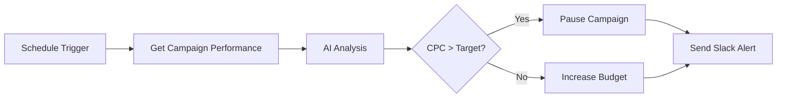
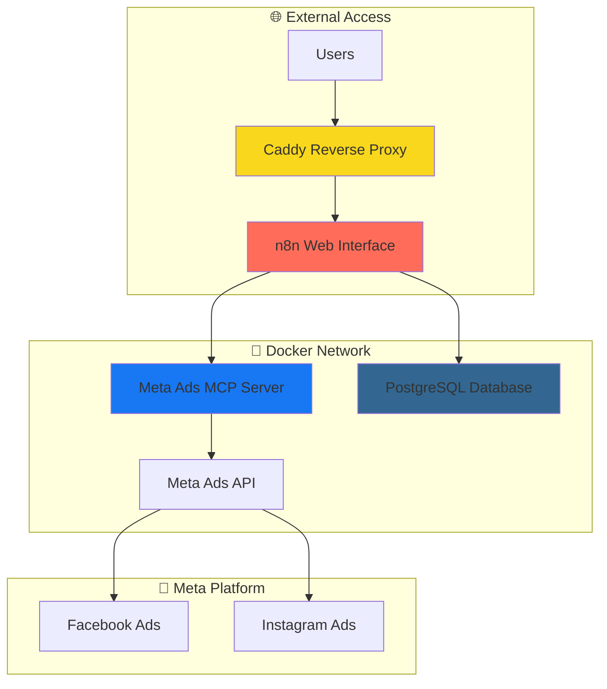

# 🚀 n8n + Meta Ads MCP: AI-Powered Campaign Automation

[](https://www.docker.com/)
[](https://n8n.io/)
[](https://developers.facebook.com/)
[]()
[](https://www.digitalocean.com/)

**Transform your Meta advertising with AI-powered automation. Use natural language to analyze campaigns, optimize budgets, and manage ads across Facebook and Instagram.**

[🎯 Quick Start](#-quick-start) • [📖 Demo](#-demo--screenshots) • [🏗️ Architecture](#%EF%B8%8F-architecture) • [🌍 Deploy](#-deployment-guides) • [💬 Support](#-support)

---

## ✨ Features

### 🤖 AI-Powered Analysis

* Natural language campaign insights
* Automated performance recommendations
* Budget optimization suggestions
* Creative improvement feedback

### 🔄 Complete Automation

* Campaign creation & management
* Ad set optimization
* Image upload & creative management
* Performance monitoring & alerts

### 🏗️ Production Ready

* One-command Docker deployment
* SSL/HTTPS with auto-certificates
* PostgreSQL database included
* Health monitoring & logging

### 🌍 Cloud Native

* Deploy to any cloud provider
* DigitalOcean one-click setup
* Horizontal scaling support
* Container orchestration ready

### 🔐 Secure & Reliable

* OAuth 2.0 Meta authentication
* Encrypted credential storage
* Rate limiting & error handling
* Comprehensive audit logging

### 🛠️ Developer Friendly

* Visual workflow builder
* 20+ Meta Ads tools available
* Custom automation workflows
* REST API integration

## 🎯 Quick Start

Get running in under 5 minutes:

```bash
# 1. Clone and setup
git clone https://github.com/your-username/n8n-meta-ads-mcp.git
cd n8n-meta-ads-mcp

# 2. Configure environment
cp .env.example .env
# Edit .env with your Meta App ID and domain

# 3. Deploy everything
chmod +x deploy.sh
./deploy.sh

# 🎉 Access your n8n instance at the URL shown in the output!
```

**That's it!** The deployment script will show you exactly where to access n8n and your login credentials.

## 📖 Demo & Screenshots

### 🎬 What You Can Do

* **"Show me my top performing campaigns this month"** → Get AI analysis with optimization suggestions
* **"Create a new campaign for our summer sale"** → Automated campaign setup with best practices
* **"Pause all ads with CPC above $2"** → Bulk campaign management with conditions
* **"Upload this image and create 5 ad variations"** → Automated creative testing setup

### 🖼️ n8n Workflow Examples



**Available Tools:**

* `mcp_meta_ads_get_campaigns` - List and filter campaigns
* `mcp_meta_ads_get_insights` - Performance analytics
* `mcp_meta_ads_create_campaign` - Create new campaigns
* `mcp_meta_ads_upload_ad_image` - Image management
* `mcp_meta_ads_update_adset` - Budget & targeting optimization
* ... and 15+ more tools

## 🏗️ Architecture



### Components:

* **🔄 n8n** : Visual workflow automation platform with Meta Ads integration
* **🤖 Meta Ads MCP** : Model Context Protocol server providing 20+ Meta advertising tools
* **🔀 Caddy** : Automatic HTTPS reverse proxy with SSL certificate management
* **💾 PostgreSQL** : Production-grade database for workflow and execution data
* **🏥 Health Monitoring** : Built-in health checks and logging for all services

## 📦 Installation

### Prerequisites

* 🐳 Docker & Docker Compose installed
* 🌐 Domain name pointing to your server (for SSL)
* 🔑 Meta Developer App with Marketing API access

### Step-by-Step Setup

#### 🔧 1. Environment Setup

```bash
# Clone repository
git clone https://github.com/your-username/n8n-meta-ads-mcp.git
cd n8n-meta-ads-mcp

# Create environment file
cp .env.example .env

# Edit configuration
nano .env
```

**Required Environment Variables:**

```bash
# Domain Configuration
DOMAIN_NAME=yourdomain.com
N8N_HOST=n8n.yourdomain.com

# n8n Authentication  
N8N_BASIC_AUTH_USER=admin
N8N_BASIC_AUTH_PASSWORD=your_secure_password

# Meta Ads Configuration
META_APP_ID=your_meta_app_id
META_ACCESS_TOKEN=your_access_token

# Database (optional - uses SQLite by default)
DB_TYPE=postgresdb
DB_POSTGRESDB_PASSWORD=your_db_password
```

#### 🔑 2. Meta Developer App Setup

1. Go to [Meta for Developers](https://developers.facebook.com/)
2. Create a new **"Consumer"** app
3. Add **"Marketing API"** product
4. Configure OAuth redirect URI: `http://localhost:8888/callback`
5. Copy your App ID to the `.env` file
6. Generate an access token with required permissions

**Required Permissions:**

* `ads_management`
* `ads_read`
* `business_management`

#### 🚀 3. Deployment

```bash
# Make deployment script executable
chmod +x deploy.sh

# Deploy with one command
./deploy.sh
```

The script will:

* ✅ Build all Docker containers
* ✅ Start all services with proper dependencies
* ✅ Wait for services to be ready
* ✅ Display access URLs and credentials
* ✅ Provide debugging information

## ⚙️ Configuration

### Environment Variables Reference

| Variable                    | Required | Default | Description                             |
| --------------------------- | -------- | ------- | --------------------------------------- |
| `N8N_HOST`                | ✅       | -       | Your n8n domain (e.g., n8n.example.com) |
| `META_APP_ID`             | ✅       | -       | Meta Developer App ID                   |
| `META_ACCESS_TOKEN`       | ⚠️     | -       | Meta API access token (or use OAuth)    |
| `N8N_BASIC_AUTH_USER`     | ✅       | admin   | n8n login username                      |
| `N8N_BASIC_AUTH_PASSWORD` | ✅       | -       | n8n login password                      |
| `DB_TYPE`                 | ❌       | sqlite  | Database type (sqlite/postgresdb)       |
| `GENERIC_TIMEZONE`        | ❌       | UTC     | Timezone for scheduling                 |

### n8n MCP Client Configuration

Once deployed, configure the Meta Ads MCP client in n8n:

1. **Install Community Package** : `n8n-nodes-mcp`
2. **Create MCP Client Node**
3. **Configure Connection** :

* **Type** : MCP Client (STDIO) API
* **Command** : `docker`
* **Arguments** : `exec,-i,n8n-meta-ads-mcp-meta-ads-mcp-1,/home/mcp/.local/bin/meta-ads-mcp,--app-id,YOUR_META_APP_ID`

### Advanced Configuration

#### 🔒 Production Security Settings

```bash
# Generate secure passwords
openssl rand -base64 32

# Use environment file secrets
echo "DB_PASSWORD=$(openssl rand -base64 32)" >> .env

# Enable additional security headers
export N8N_SECURE_COOKIE=true
export N8N_COOKIE_SAME_SITE_POLICY=strict
```

#### 📊 Performance Tuning

```bash
# Scale for high workloads
export N8N_EXECUTIONS_MODE=queue
export N8N_EXECUTIONS_PROCESS=main

# Database optimization
export DB_POSTGRESDB_POOL_SIZE=20
export DB_POSTGRESDB_MAX_CONNECTIONS=100
```

## 💡 Usage Examples

### 🎯 Campaign Performance Analysis

```javascript
// Workflow: Daily Campaign Performance Report
// Trigger: Schedule (daily at 9 AM)
// Step 1: Get yesterday's campaign data
// Step 2: AI analysis with Meta Ads MCP
// Step 3: Send Slack/email report with insights
```

### 💰 Budget Optimization Automation

```javascript
// Workflow: Smart Budget Reallocation  
// Trigger: Schedule (every 2 hours)
// Logic: Move budget from low-performing to high-performing campaigns
// Conditions: CPC, ROAS, daily spend thresholds
```

### 🚨 Performance Monitoring & Alerts

```javascript
// Workflow: Campaign Health Monitoring
// Trigger: Schedule (every 30 minutes)
// Alerts: CPC spikes, budget depletion, approval issues
// Actions: Auto-pause, budget adjustments, team notifications
```

### 📈 A/B Testing Automation

```javascript
// Workflow: Automated Creative Testing
// Trigger: New creative upload
// Process: Create multiple ad variations, set testing budget
// Analysis: Determine winner after statistical significance
```

## 🌍 Deployment Guides

### ☁️ DigitalOcean (Recommended)

#### One-Click DigitalOcean Deployment

1. **Create Droplet** :

* Choose **Docker** marketplace image
* Select **Basic Plan** ($12/month minimum)
* Add your SSH key

1. **Deploy** :

```bash
   # SSH into droplet
   ssh root@your_droplet_ip

   # Clone and deploy
   git clone https://github.com/your-username/n8n-meta-ads-mcp.git
   cd n8n-meta-ads-mcp
   cp .env.example .env
   # Edit .env with your settings
   ./deploy.sh
```

1. **DNS Setup** :

* Point your domain to the droplet IP
* SSL certificates are automatic via Caddy

 **Cost** : ~$12-24/month for basic usage

### 🚀 AWS/GCP/Azure

#### Cloud Provider Deployment

**AWS EC2:**

```bash
# Launch Ubuntu instance with Docker
# Open ports 80, 443, 22 in security group
# Follow standard deployment steps
```

**Google Cloud:**

```bash
# Create VM with Container-Optimized OS
# Configure firewall rules for HTTP/HTTPS
# Deploy using provided docker-compose
```

**Azure:**

```bash
# Create Container Instance
# Configure application gateway for SSL termination
# Deploy with Azure Container Instances
```

### 🏠 Self-Hosted / VPS

#### Self-Hosted Deployment

**Requirements:**

* Ubuntu 20.04+ or similar Linux distribution
* 2GB+ RAM, 20GB+ storage
* Docker & Docker Compose installed
* Open ports 80, 443

**Quick Setup:**

```bash
# Install Docker
curl -fsSL https://get.docker.com -o get-docker.sh
sh get-docker.sh

# Install Docker Compose
pip install docker-compose

# Deploy application
git clone https://github.com/your-username/n8n-meta-ads-mcp.git
cd n8n-meta-ads-mcp
./deploy.sh
```

## 🐛 Troubleshooting

### Common Issues

#### 🔧 "Failed to execute operation: The file or directory does not exist"

 **Cause** : n8n container can't access Docker socket or missing Docker CLI

 **Fix** :

```bash
# Rebuild n8n with Docker CLI
docker-compose build --no-cache n8n
docker-compose up -d n8n

# Test Docker access
docker-compose exec n8n docker ps
```

#### 🔐 "Permission denied while trying to connect to Docker daemon socket"

 **Cause** : Node user not in docker group

 **Fix** : Already handled in the provided Dockerfile. If issues persist:

```bash
# Check Docker socket permissions
ls -la /var/run/docker.sock
stat -c '%g' /var/run/docker.sock

# Rebuild with correct group ID
docker-compose build --no-cache n8n
```

#### 🌐 SSL Certificate Issues

 **Symptoms** : Site not accessible via HTTPS, certificate errors

 **Fix** :

```bash
# Check DNS propagation
nslookup your-domain.com

# Check Caddy logs
docker-compose logs caddy

# Wait 2-3 minutes for initial certificate generation
```

#### 🤖 Meta Ads MCP Authentication Errors

 **Symptoms** : "META_APP_SECRET not set" warnings, authentication failures

 **Fix** :

```bash
# Add Meta App Secret to .env
echo "META_APP_SECRET=your_app_secret" >> .env

# Restart MCP container
docker-compose restart meta-ads-mcp

# Check MCP authentication
docker-compose logs meta-ads-mcp
```

### Getting Help

* 📋  **Check Logs** : `docker-compose logs [service_name]`
* 🏥  **Health Checks** : Visit health endpoints shown by `./show-access-info.sh`
* 🔍  **Debug Mode** : Add `DEBUG=1` to `.env` for verbose logging
* 💬  **Community** : [Create an issue](https://github.com/your-username/n8n-meta-ads-mcp/issues) for help

## 🤝 Contributing

We welcome contributions! Here's how to get started:

### 🛠️ Development Setup

```bash
# Fork and clone the repository
git clone https://github.com/your-username/n8n-meta-ads-mcp.git
cd n8n-meta-ads-mcp

# Create feature branch
git checkout -b feature/your-feature-name

# Set up development environment
cp .env.example .env.dev
# Configure with development settings

# Run in development mode
docker-compose -f docker-compose.dev.yml up -d
```

### 📝 Making Changes

1. **🔍 Issues First** : Check [existing issues](https://github.com/your-username/n8n-meta-ads-mcp/issues) or create a new one
2. **🌿 Branch** : Create a feature branch from `main`
3. **✅ Test** : Ensure all changes work with the test suite
4. **📖 Document** : Update README and code comments
5. **🔄 Pull Request** : Submit PR with clear description

### 🧪 Testing

```bash
# Run test suite
docker-compose exec n8n npm test

# Test MCP communication
./test-mcp.sh

# Test deployment script
./deploy.sh --test
```

### 📋 Development Guidelines

* Follow existing code style and patterns
* Add comprehensive error handling
* Include logging for debugging
* Update documentation for new features
* Test on multiple environments

## 🗺️ Roadmap

### 🎯 Current Features (v1.0)

* ✅ Meta Ads MCP integration with 20+ tools
* ✅ Production-ready Docker deployment
* ✅ SSL/HTTPS with automatic certificates
* ✅ PostgreSQL database support
* ✅ Health monitoring and logging

### 🚀 Upcoming Features (v1.1)

* 🔄  **Multi-Account Support** : Manage multiple Meta ad accounts
* 📊  **Advanced Analytics** : Custom dashboards and reporting
* 🤖  **AI Optimization** : Automated bid and budget optimization
* 🔗  **More Integrations** : Google Ads, LinkedIn Ads, TikTok Ads
* 📱  **Mobile App** : Native mobile app for monitoring

### 🌟 Future Vision (v2.0)

* 🧠  **Advanced AI** : GPT-powered campaign strategies
* 🏢  **Multi-Tenant** : SaaS version for agencies
* 🔌  **Plugin System** : Custom MCP server development
* 🌍  **Global CDN** : Distributed deployment options

## 📊 Performance & Limitations

### 📈 Performance Metrics

* **Response Time** : < 2s for most MCP operations
* **Throughput** : 100+ API calls per minute (Meta API limits apply)
* **Uptime** : 99.9% with proper deployment
* **Resource Usage** : ~1GB RAM, ~500MB storage for basic setup

### ⚠️ Current Limitations

* Meta API rate limits apply (200 calls per hour per user)
* OAuth flow requires manual browser authentication
* Single Meta App ID per deployment
* Limited to Facebook/Instagram advertising

### 📏 Scaling Considerations

* **Small Teams** : Single droplet deployment ($12/month)
* **Growing Businesses** : Multi-node setup with load balancer
* **Enterprise** : Kubernetes deployment with auto-scaling

## 🔐 Security

### 🛡️ Security Features

* OAuth 2.0 authentication with Meta
* Encrypted credential storage
* HTTPS/SSL by default
* Rate limiting and request validation
* Audit logging for all actions

### 🔒 Security Best Practices

* Keep environment variables secure
* Regularly update container images
* Monitor access logs
* Use strong passwords and API keys
* Enable firewall on deployment server

### 🚨 Reporting Security Issues

Found a security vulnerability? Please email security@your-domain.com instead of creating a public issue.

## 📄 License

This project is licensed under the **MIT License** - see the [LICENSE]() file for details.

### 🙏 Attribution

* Built with [n8n](https://n8n.io/) - Fair-code workflow automation
* Uses [Meta Marketing API](https://developers.facebook.com/docs/marketing-apis/)
* Powered by [Model Context Protocol](https://modelcontextprotocol.io/)
* SSL certificates by [Caddy](https://caddyserver.com/)

## 💬 Support

### 📞 Getting Help

* 📚  **Documentation** : Start with this README and the troubleshooting section
* 🐛  **Bug Reports** : [Create an issue](https://github.com/your-username/n8n-meta-ads-mcp/issues/new?template=bug_report.md)
* 💡  **Feature Requests** : [Request a feature](https://github.com/your-username/n8n-meta-ads-mcp/issues/new?template=feature_request.md)
* 💬  **Community** : Join our [Discord](https://discord.gg/your-server) for discussions

### 🚀 Professional Support

Need enterprise support, custom development, or managed hosting? Contact us at support@your-domain.com

---

**⭐ Star this repository if it helped you automate your Meta advertising!**

[](https://github.com/your-username/n8n-meta-ads-mcp/stargazers)
[](https://github.com/your-username/n8n-meta-ads-mcp/network/members)

[🔝 Back to Top](#-n8n--meta-ads-mcp-ai-powered-campaign-automation)
